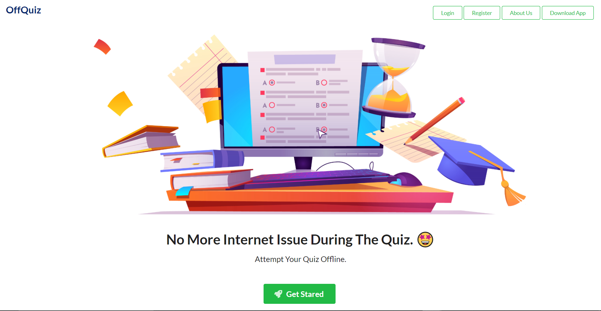
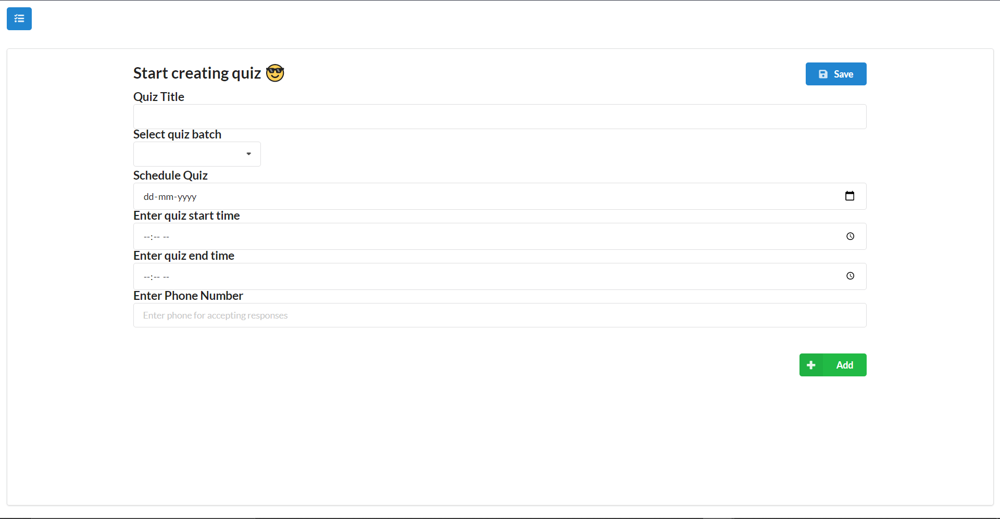
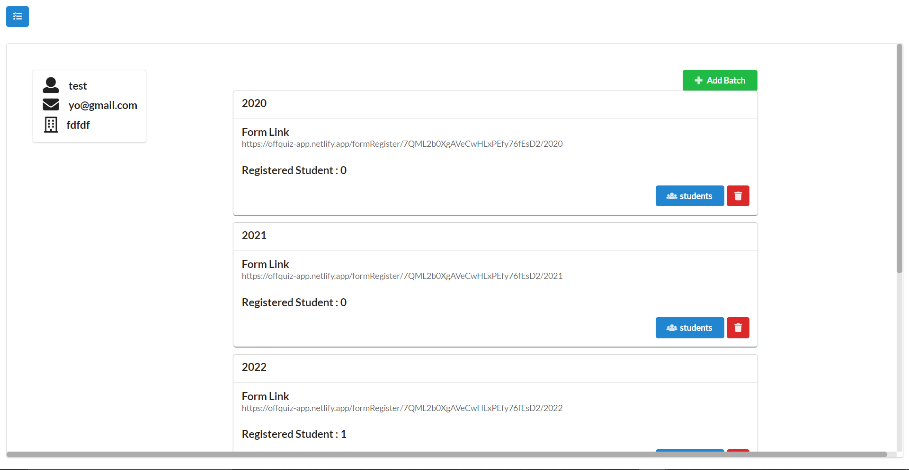
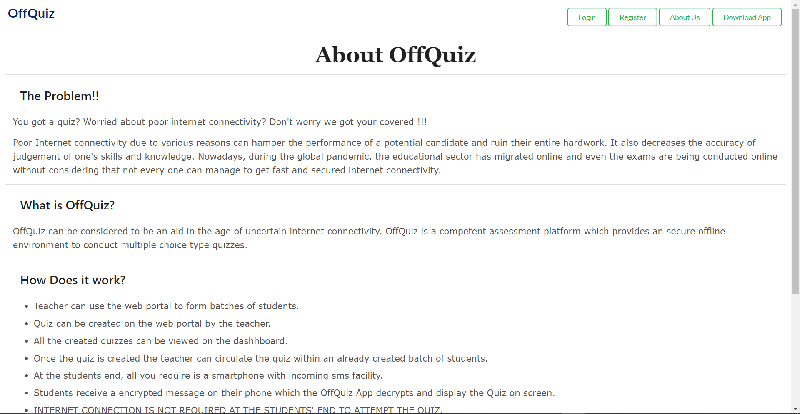

# 📝 OffQuiz-Web-App
<h2>
       ❓ Problem this project is aiming to solve 
        </h2>
        <p>
          Poor Internet connectivity due to various reasons can hamper the
          performance of a potential candidate and ruin their entire hardwork.
          It also decreases the accuracy of judgement of one's skills and
          knowledge. Nowadays, during the global pandemic, the educational
          sector has migrated online and even the exams are being conducted
          online without considering that not every one can manage to get fast
          and secured internet connectivity.
        </p>
        <h2> 🤔 What is OffQuiz? </h2>
        <p>
          OffQuiz can be considered to be an aid in the age of uncertain
          internet connectivity. OffQuiz is a competent assessment platform
          which provides an secure offline environment to conduct multiple
          choice type quizzes.
        </p>       
        <h2> 🏢 How Does it work?</h2>
          <ul>
            <li>
              Teacher can use the web portal to form batches of students.
            </li>
            <li>
              Quiz can be created on the web portal by the teacher.
            </li>
            <li>
              All the created quizzes can be viewed on the dashhboard.
            </li>
            <li>
              Once the quiz is created the teacher can circulate the quiz within
              an already created batch of students.
            </li>
            <li>
              At the students end, all you require is a smartphone with incoming
              sms facility.
            </li>
            <li>
              Students receive a encrypted message on their phone which the
              OffQuiz App decrypts and display the Quiz on screen.
            </li>
            <li>
              <b>INTERNET CONNECTION IS NOT REQUIRED AT THE STUDENTS' END TO
               ATTEMPT THE QUIZ. </b>
            </li>
            <li>
              The Quiz Responses are encrypted and sent to our servers through
              sms.
            </li>
            <li>
              Teacher can view the responses of all the student on our web
              application.
            </li>
            </ul>
            
  # 📷 Sneak Peak: 
  
   </img> <br>
   </img> <br />
    </img> <br />
   </img> <br />
   </img>
  
  
  # 🛠️ How to use OffQuiz system locally 
  
  ### Steps to run app
  - headover [here](https://drive.google.com/file/d/1h5f8Sk-a7c6reZ-NQET82dVXGAnsmxS5/view) and download app.

  ### Steps to run client 

- First you need to clone the project using command `git clone https://github.com/nlok5923/OffQuiz-Web-App.git`
- Change the directroy to `OffQuiz-Web-App` using `cd OffQuiz-Web-App` and then move to client folder using `cd client`
- Now you need to install all packages first do it using command `npm install` 
- To start the server run command `npm start` 

### Steps to run server
- Considering you are inside the root directory of this repository.
- first you need to create `.env` file by copying the `.env.example` by command `cp .env.example .env` and replacing dummy tokens with original tokens.
- `.env` will look like the below code.

```
PORT=<port>
SESSION_SECRET=<secret>
ACCOUNT_ID=<enter account id>
AUTH_TOKEN=<account token>
TWILIO_NO=<twilio no>
TWILIO_NOTIFY_SERVICE_SID=<service id>
```

- `PORT` write the port of your choice but it should be different than those which is client using currently.
- `SESSION_SECRET` enter a random text of your choice in it.
- For `ACCOUNT_ID`, `AUTH_TOKEN` and `TWILIO_NO` head over [here](https://www.twilio.com/login) create twilio account and buy twilio number.
- for twilio token head over  [here](https://www.twilio.com/login) buy sample test phone number and fetch all required credentials.
- Now you need to create a notification service to send bulk sms you can follow [this](https://www.geeksforgeeks.org/sending-bulk-sms-in-node-js-using-twilio/) tutorial to create it and once done you will have `TWILIO_NOTIFY_SERVICE_SID` in place.
- Now let's install all packages and dependencies using command `npm install`.
- To run server just type `node app.js`.   

## 👨🏻‍💻 Tech Stack used;

<details>
<summary> Frontend </summary>
  
- Reactjs
- CSS with Sass 
- Semantic UI library
 </details>
 
 <details>
<summary> Backend </summary>

- nodejs
- Expressjs 
 </details>
 
 <details>
<summary> Database </summary>

- Firestore
- Firebase
 </details>
 
 <details>
<summary> API </summary>

- Twilio
 </details>

## Overview

   </img>
  
## 💫 Addtionals:

- Frontend of offquiz web app is deployed at https://offquiz-app.netlify.app/
- Backend of the OffQuiz web app is deployed at https://peaceful-island-93608.herokuapp.com/

